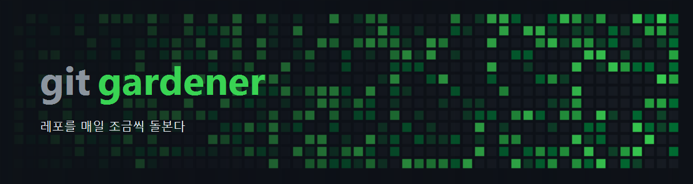

<p align="center">
  
</p>

<p align="center">
  <strong>정원사는 매일 조금씩 돌본다</strong>
</p>

<p align="center">
  트레이에 상주하다가 방치된 레포를 골라 이슈를 열고, 고치고, PR까지 올린다.<br>
  사람이 하는 일은 <strong>머지 버튼 하나.</strong><br>
  빈 커밋도 공백 수정도 쓰지 않는다. 고칠 게 없으면 그날은 그냥 넘어간다.
</p>

<p align="center">
  <a href="#license"></a>
  
  
  
</p>

<p align="center">
  <a href="#see-it">See it</a> ·
  <a href="#install">Install</a> ·
  <a href="#아이디어-한-줄로-시작한다">아이디어</a> ·
  <a href="#이슈에서-출발한다">이슈</a> ·
  <a href="#안전장치">안전장치</a> ·
  <a href="#한계">한계</a> ·
  <a href="docs/PLAN.md">설계</a> ·
  <a href="docs/SETUP.md">세팅</a>
</p>

---

## See it

아무것도 안 시켰는데 [daily-tangle](https://github.com/nohseongmin/daily-tangle)에 이게 올라왔다.

<table>
<tr>
<th width="50%">📮 이슈 #1 — 문제를 먼저 연다</th>
<th width="50%">🔧 PR #2 — 그걸 닫는다</th>
</tr>
<tr>
<td valign="top">

**recompute의 지역변수 이름이 실제 값과 맞지 않음**

> `recompute()`에서 이전 교차 쌍 수를 담는 변수 이름이 `wasClear`였다. 값은 숫자(카운트)인데 이름은 불리언처럼 보여, 코드베이스의 "불리언은 is/has/should" 규칙과 어긋나고 `if (r.pairs < wasClear)` 같은 비교식을 읽을 때 오해를 유발한다.

</td>
<td valign="top">

**Refactor: 교차 수 카운트 변수의 오해 소지 있는 불리언식 이름 정정**

```diff
-  const wasClear = state.crossPairs;
+  const prevPairs = state.crossPairs;
-  else if (r.pairs < wasClear) SFX.clear();
+  else if (r.pairs < prevPairs) SFX.clear();
```

브랜치 `refactor/rename-prev-pairs/#1`

</td>
</tr>
</table>

이슈를 여는 것부터 PR이 올라가기까지 **49초.** 커밋 작성자에 봇 표시도, 본문에 "자동 생성됨" 푸터도 없다. 그 레포의 PR 템플릿을 읽어서 채우기 때문에 사람이 올린 PR과 같은 모양이 나온다.

## Install

[Releases](https://github.com/nohseongmin/git-gardener/releases/latest)에서 `GitGardener.exe` 하나만 받아 실행한다. 설치 마법사가 뜬다.

받은 파일이 "안전하지 않은 앱"으로 막히면 `Unblock-File .\GitGardener.exe` 로 다운로드 표식만 떼면 된다. 파일 속성 창의 "차단 해제" 체크와 같다.

### 마법사가 하는 일

**1. 고지** — 내 계정으로 이슈와 PR이 올라간다는 것, 요금이 드는 Claude Code 계정이 필요하다는 것, 만들어진 코드가 검증되지 않았다는 것. 동의해야 넘어간다.

**2. 검사** — 아래 일곱 가지를 실제로 실행해 확인한다.

| 항목 | 빠졌을 때 |
|---|---|
| `git` | `winget install Git.Git` |
| git 커밋 작성자 | `user.name` / `user.email` 설정 |
| [`gh`](https://cli.github.com/) | `winget install --id GitHub.cli -e` |
| gh 로그인 | `gh auth login` |
| git 자격증명 헬퍼 | `gh auth setup-git` — 없으면 자동 push가 인증창에서 멈춘다 |
| [`claude`](https://claude.com/claude-code) | `npm i -g @anthropic-ai/claude-code` |
| claude 로그인 (자동 세션 전용) | **[claude 로그인 창 열기]** 버튼 |

**빠진 것을 대신 설치하지는 않는다.** 내 PC에 무엇이 깔릴지는 쓰는 사람이 정할 몫이라, 무엇이 없는지와 어떤 명령을 치면 되는지까지만 보여주고 다시 검사한다. 항목을 누르면 명령이 복사된다.

**3. 설치** — 기본값은 `C:\GitGardener` + 바탕화면 바로가기 + 로그온 자동 실행. 위치는 바꿀 수 있다.

설정과 로그, 작업 사본은 실행 파일을 어디에 두든 사용자 폴더에 남는다. 프로그램과 데이터는 따로 둔다.

### 자동 세션용 claude 로그인

검사 화면의 **[claude 로그인 창 열기]** 를 누르면 환경 변수가 이미 잡힌 PowerShell 창이 열리고 claude가 떠 있다. `/login` 만 입력하면 된다.

<details>
<summary><strong>왜 따로 로그인하나 — 안 그러면 쓰던 Claude Code 가 401 을 맞는다</strong></summary>

Claude Code 는 OAuth 토큰을 `~/.claude/.credentials.json` 에 두고 만료되면 갱신한다. 갱신은 옛 토큰을 무효로 만들고 파일을 덮어쓴다.

자동 세션이 같은 파일을 쓰면 이 갱신이 사용자 몫의 토큰까지 갈아치운다. 대화형 Claude Code 는 메모리에 옛 토큰을 들고 있으므로 그다음 요청에서 `API Error 401` 을 맞는다. 자동 실행이 도는 동안 쓰던 창이 죽는 것이다.

자동 실행 시작 3초 뒤에 자격증명 파일이 다시 쓰이는 것을 확인했다. `CLAUDE_CONFIG_DIR` 로 저장소를 나눠 갖는 것으로 끊었고, 그래서 전용 폴더에 한 번 로그인해야 한다.

같이 쓰고 싶으면 `config.json` 의 `separateClaudeConfig` 를 `false` 로 두면 된다. 401 은 감수해야 한다.

</details>

<details>
<summary><strong>자동 실행에 시작 폴더를 쓰는 이유</strong></summary>

`HKCU\...\Run` 키를 쓰다가 옮겼다. 등록도 되어 있고 사용 안 함 플래그도 없는데 로그온 때 실행되지 않는 일이 있었다. 탐색기는 정상 시작했고 실행 파일도 멀쩡한데 프로세스만 뜨지 않았다.

예약 작업(`schtasks /SC ONLOGON`)은 관리자 권한을 요구해서 설치 과정에 넣을 수 없다. 시작 폴더는 권한 없이 되고 탐색기가 로그온마다 처리한다. 예전 Run 키 항목이 남아 있으면 지운다. 둘 다 살아 있으면 로그온 때 두 번 뜬다.

</details>

<details>
<summary><strong>소스에서 빌드하려면</strong></summary>

```bash
git clone https://github.com/nohseongmin/git-gardener && cd git-gardener
```

```powershell
dotnet publish src/GitGardener -c Release -r win-x64 --self-contained -p:PublishSingleFile=true
```

나온 실행 파일을 그냥 실행하면 같은 마법사가 뜬다. 소스에서 빌드한 파일에는 다운로드 표식이 없어 경고도 없다.

</details>

## 아이디어 한 줄로 시작한다

돌볼 레포가 있어야 정원사가 일한다. 없으면 만든다.

창 위쪽 칸에 한 줄을 적고 `레포 만들기` 를 누르면:

```
"동아리 회비 안 낸 사람 자동으로 알려주는 웹"
   ↓
README.md · docs/PLAN.md · .gitignore · LICENSE 작성
   ↓
비공개 저장소 생성 + 첫 커밋 푸시
   ↓
기획서의 "MVP 작업" 체크리스트 → 이슈 5~8개
   ↓
대상 레포에 자동 등록
```

기획서에는 문제, 쓸 사람, 차별점, 수익 모델, 기술 스택, 보안, MVP 범위, 안 할 것이 들어간다.
스택은 그 아이디어에 가장 흔하고 지루한 것을 고르게 했다. 새 프레임워크 구경시키는 자리가 아니다.

여기서 만든 이슈가 그대로 다음 날 일과가 된다. **기획이 이슈가 되고, 이슈가 매일 코드가 된다.**

## 이슈에서 출발한다

사람이 올린 PR은 이슈에서 시작한다. 자동 PR도 그렇게 만든다.

| 모드 | 동작 |
|---|---|
| **이슈 우선** (기본) | 열린 이슈가 있으면 그걸 해결한다. 없으면 스스로 찾아 고친 뒤 이슈를 만들고 `Closes`로 건다 |
| **이슈 있을 때만** | 이슈가 없으면 그 레포는 건너뛴다. 내가 시킨 것만 하게 하는 모드 |
| **이슈 없이** | 이슈를 보지도 만들지도 않는다 |

이슈를 하나 열어두면 다음 실행 때 그걸 물고 간다. 이미 열린 PR이 잡고 있는 이슈는 건너뛰므로 한 이슈에 PR이 쌓이지 않는다.

PR이 아직 열려 있는 레포는 아예 다음 날 대상에서 빠진다. 그 수정이 기본 브랜치에 들어가기 전까지는 같은 문제가 그대로 보이고, 그걸 또 고치면 이슈와 PR이 겹치기 때문이다. 머지하면 다시 대상에 들어온다.

## 안전장치

- **가짜 커밋을 만들지 않는다.** 실제 diff가 없으면 브랜치를 지우고 그날은 넘어간다.
- **같은 곳에 PR을 쌓지 않는다.** 열린 PR이 남아 있는 레포는 머지될 때까지 대상에서 뺀다.
- **main을 건드리지 않는다.** 기본 브랜치에 직접 커밋하는 코드 경로가 없다.
- **작업 사본에서만 돈다.** 개발 중인 로컬 폴더는 손대지 않고 `%LOCALAPPDATA%\GitGardener\repos\`의 별도 사본에서만 작업한다.
- **셸을 주지 않는다.** 자동 세션에는 파일 편집 도구만 허용하고 Bash는 차단한다. git과 PR 조작은 전부 앱이 한다.
- **Dry-run은 아무것도 만들지 않는다.** 편집과 diff까지만 보여주고 이슈도 PR도 건드리지 않는다.
- **언제든 멈출 수 있다.** 도는 중에 `중단`을 누르면 진행 중인 claude 프로세스까지 정리하고 끊는다. 창을 안 열었으면 트레이 메뉴에도 있다.

<details>
<summary><strong>주입되는 코딩 규칙</strong></summary>

자동 세션은 [coding-rules](https://github.com/nohseongmin/coding-rules)의 `RULES.md`와 [ponytail](https://github.com/DietrichGebert/ponytail) 미니멀리즘 룰셋을 시스템 프롬프트로 받는다. 이 중 넷이 자동화의 실질적 제약이다.

| 규칙 | 자동화에서의 의미 |
|---|---|
| **P0-5** 최소 변경 | 요청 범위 밖 리팩토링 금지. 한 번에 한 건으로 제한하는 근거 |
| **P0-2** 코드베이스에 맞춰라 | 주변 스타일을 따라가야 PR이 튀지 않는다 |
| **R-1** 안전망 있는 리팩토링 | 테스트 없는 레포에서는 구조 변경 대신 문서·주석 위주로 |
| **V-3** 브랜치 분리 | 기본 브랜치 직접 푸시 금지 |

규칙을 고치려면 git gardener가 아니라 coding-rules 레포를 고친다. 하루 한 번 받아서 캐시한다.

</details>

<details>
<summary><strong>파이프라인</strong></summary>

```
스케줄 발화 (또는 부팅 후 catch-up)
   ↓
대상 레포 선택 (가장 오래 안 건드린 것부터, 열린 PR이 있는 레포는 제외)
   ↓
열린 이슈 선택  ── 없으면 ──→ 스스로 고칠 것을 찾는다
   ↓
작업 사본 동기화  fetch + reset --hard + clean
   ↓
Claude 헤드리스 실행  ← 코딩 규칙 + 그 레포의 PR 템플릿 주입, 편집 도구만 허용
   ↓
변경 있나?  ── 없음 ──→ 브랜치 삭제, 스킵
   ↓ 있음
(이슈가 없었다면 여기서 이슈 생성)
   ↓
브랜치 확정  refactor/rename-prev-pairs/#1
   ↓
커밋 → push → PR 생성 (Closes #1)
   ↓
트레이 알림 + PR 링크
```

노트북이 꺼져 있어 예약 시각을 놓친 날은 부팅 5분 뒤에 밀린 실행을 따라잡는다. 이게 없으면 손이 아예 안 간다.

</details>

## 한계

**빌드 검증을 하지 않는다.** 자동 세션에는 셸이 없어서 컴파일도 테스트도 돌려보지 못한다. PR 승인이 사람 손에 있어 기본 브랜치는 안전하지만, **깨진 코드가 PR로 올라올 수 있다는 걸 전제로 리뷰해야 한다.** 문서나 이름 변경 같은 건 괜찮고, 로직을 건드린 PR은 머지 전에 직접 빌드해보는 게 맞다.

**소재는 마른다.** 활성 레포 몇 개만 켜두면 몇 주 안에 고칠 게 없어진다. 대상을 넓게 켜두는 편이 낫다.

## 스택

C# / .NET 9 / WinForms, 소스 6개 파일.

NuGet 패키지는 쓰지 않는다. `System.Text.Json`, `NotifyIcon`, 레지스트리 접근이 전부 런타임에 들어 있어서 복원할 것이 없고, 자체 포함 단일 실행 파일로 나간다.

다만 **패키지가 없다는 것과 의존성이 없다는 것은 다르다.** 이 앱이 하는 일의 대부분은 `git` · `gh` · `claude`를 부르는 것이고, 그중 둘은 사람이 로그인해둬야 동작한다. 무거운 쪽은 오히려 이쪽이다.

## License

[MIT](LICENSE)
