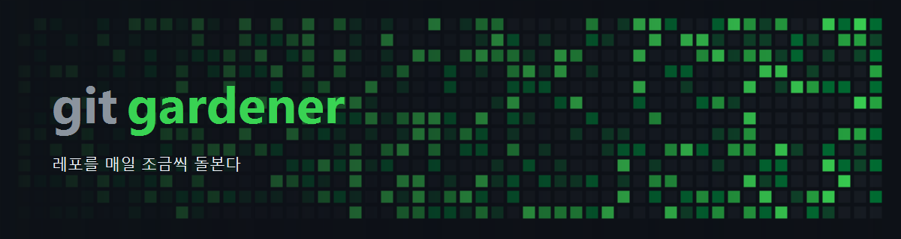

# Git Gardener

A Windows tray app that maintains selected GitHub repositories. It picks an issue or a small improvement, edits a separate working copy, and opens a pull request. Merging remains manual. If there is no diff, it skips the run.



## Example

In [daily-tangle](https://github.com/nohseongmin/daily-tangle), the app opened an issue about a misleading variable name and a pull request to change it:

```diff
-  const wasClear = state.crossPairs;
+  const prevPairs = state.crossPairs;
-  else if (r.pairs < wasClear) SFX.clear();
+  else if (r.pairs < prevPairs) SFX.clear();
```

The variable held a count rather than a boolean. The recorded run took 49 seconds from issue creation to pull request. Pull requests use the repository's template.

## Installation

Download `GitGardener.exe` from [Releases](https://github.com/nohseongmin/git-gardener/releases/latest) and run the setup wizard. If Windows blocks the downloaded file, `Unblock-File .\GitGardener.exe` removes its download marker, equivalent to the file properties option.

The wizard explains that issues and pull requests are created under your account, Claude Code requires a paid account, and generated changes need review. It then checks:

| Requirement | Setup |
|---|---|
| Git | `winget install Git.Git` |
| Commit identity | Configure `user.name` and `user.email`. |
| [GitHub CLI](https://cli.github.com/) | `winget install --id GitHub.cli -e` |
| GitHub authentication | `gh auth login` |
| Git credential helper | `gh auth setup-git` |
| [Claude Code](https://claude.com/claude-code) | `npm i -g @anthropic-ai/claude-code` |
| Dedicated Claude login | Use the wizard's login button. |

Missing tools are reported with setup commands, not installed automatically. The default program location is `C:\GitGardener`, with desktop and logon shortcuts; it can be changed. Data and logs remain in the user profile.

## Automated Claude login

The wizard opens a PowerShell window with the dedicated Claude configuration set. Enter `/login` there.

Claude refreshes OAuth credentials in its configuration directory. Sharing that directory with an interactive session can invalidate the session's in-memory token and cause a 401 error. Git Gardener uses `CLAUDE_CONFIG_DIR` to separate automated credentials. Setting `separateClaudeConfig` to `false` in `config.json` shares them again and restores that risk.

Logon launch uses the Startup folder rather than the registry Run key. It works without administrator rights. Remove an old Run-key entry if present to avoid duplicate launches.

## Creating a repository from an idea

Enter an idea in the top field and choose the create-repository action. The app writes `README.md`, `docs/PLAN.md`, `.gitignore`, and `LICENSE`, creates a private repository, pushes its initial commit, opens five-to-eight MVP issues, and adds it to the target list.

The plan covers the problem, audience, differentiation, business model, technology, security, scope, and exclusions. Those issues become input for later maintenance runs.

## Issue modes

| Mode | Behavior |
|---|---|
| Issue first, default | Resolve an open issue; otherwise find an improvement, then create a linked issue. |
| Issues only | Skip repositories without open issues. |
| No issues | Neither read nor create issues. |

Issues already linked to an open pull request are skipped. Repositories with open pull requests are excluded until those changes are merged, avoiding duplicate fixes.

## Execution and controls

The scheduler chooses the least recently maintained eligible repository. It synchronizes a dedicated working copy, runs Claude with the coding rules and repository PR template, and permits file editing tools only. Git operations and PR creation are handled by the app.

No diff means no commit: the branch is removed and the run is skipped. With a diff, the app creates an issue if needed, commits to a separate branch, pushes it, opens a linked PR, and shows a tray notification.

Working copies live under `%LOCALAPPDATA%\GitGardener\repos\`. Development checkouts are left alone. Dry-run mode shows edits and the diff without creating issues or pull requests. Stop controls in the window and tray terminate the running Claude process.

Missed scheduled runs are caught up five minutes after boot.

## Coding rules

Sessions receive [coding-rules](https://github.com/nohseongmin/coding-rules) and [ponytail](https://github.com/DietrichGebert/ponytail). They require minimal changes, matching repository style, a safety net for refactors, and separate branches. Repositories without tests should receive documentation or comment changes rather than structural refactors.

The rules are fetched and cached daily. Change the coding-rules repository to update them.

## Limitations

Automated sessions have no shell, so they cannot compile or run tests. A pull request may contain broken code. Review logic changes and run the relevant checks before merging.

A small set of active repositories may run out of useful maintenance work.

## Building

```bash
git clone https://github.com/nohseongmin/git-gardener
cd git-gardener
```

```powershell
dotnet publish src/GitGardener -c Release -r win-x64 --self-contained -p:PublishSingleFile=true
```

The app uses C#, .NET 9, and WinForms, without NuGet packages. It still depends on Git, GitHub CLI, and Claude Code, including their authentication.

Pull requests run the Windows build. To release, update the project version and push its matching `vX.Y.Z` tag. GitHub Actions publishes `GitGardener.exe` and `SHA256SUMS.txt` after a successful build. Verification does not launch the executable automatically.

See [the plan](docs/PLAN.md) and [setup notes](docs/SETUP.md) for more detail.

## License

[MIT](LICENSE).
